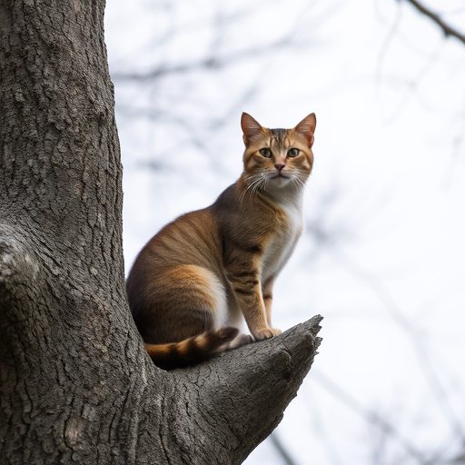

# flux.swift.cli

# FLUX.1 Image Generation Tool

## Overview

`flux.swift.cli` is a command-line interface (CLI) tool for generating images based on text prompts using the FLUX.1 model.

## Features

- **Text-to-image generation**: Generate images from text prompts.
- **Customizable parameters**: Control image size, inference steps, guidance scale, and more.
- **Model optimization**: Options for quantization and float16 precision.

## Installation

Download the latest release from the [Releases](https://github.com/mzbac/flux.swift.cli/releases/tag/0.0.1) page as a `.zip` file and extract it to your desired location.

## Usage

Once extracted, run `flux.swift.cli` via the command line:

```bash
./flux --prompt "A cat is sitting on a tree" --width 512 --height 512 --steps 4 --guidance 3.5 --output output_image.png
```


## Options

```bash
--prompt <prompt>       # The text prompt to generate an image from (default: "A cat is sitting on a tree")
--width <width>         # Image width (default: 512)
--height <height>       # Image height (default: 512)
--steps <steps>         # Number of inference steps (default: 4)
--guidance <scale>      # Guidance scale (default: 3.5)
--output <path>         # Output image path (default: "output_image.png")
--repo <repository>     # FLUX model repository (default: "black-forest-labs/FLUX.1-schnell")
--seed <seed>           # Random seed for generation (default: 2)
--quantize              # Enable model quantization
--float16               # Enable float16 precision (default: true)
```

## Example

```bash
./flux --prompt "A futuristic cityscape" --width 1024 --height 1024 --steps 10 --guidance 5.0 --output futuristic_city.png --quantize
```


This command generates a 1024x1024 image of a futuristic city, using 10 inference steps and a guidance scale of 5.0, saved as futuristic_city.png with quantization enabled.

## Model Support

Currently, `flux.swift.cli` only supports the FLUX.1-schnell model.

